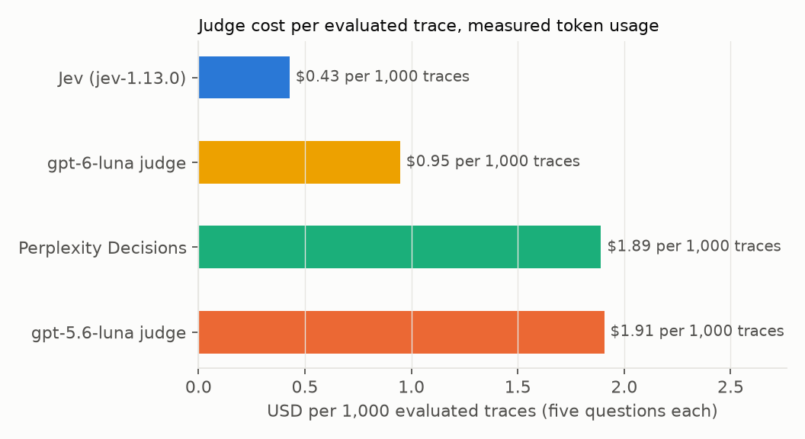
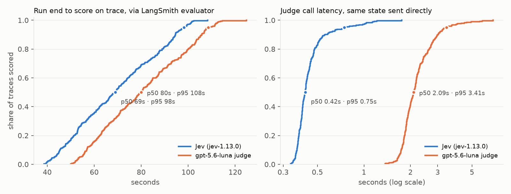

# Decision models for agentic online evaluation

Online evaluation means a judge scores your production traces as they arrive, and the scores sit on the traces for dashboards and alerts.

Almost nobody runs it on every trace. [LangSmith's guide](https://docs.langchain.com/langsmith/online-evaluations) suggests applying the evaluator to 10% of traces to control costs, and [Langfuse](https://langfuse.com/blog/2026-09-23-catching-conversation-signals-in-langfuse) describes the same habit: with LLM-as-a-judge at scale, costs "were primarily contained through sampling". I did the same on my own agents: sampled a few percent, and over time stopped checking even those.

TypeSafe released [Jev](https://typesafe.ai), a decision model that answers typed questions about a piece of context and returns probabilities instead of prose, at $0.042 per million input tokens. Three of the launch-week posts measured it as a judge:

- [LangChain](https://www.langchain.com/blog/jev-agent-evals-langsmith) judged five recorded agent runs 100 times each: Jev matched the human label on all 500, gpt-5.6-luna on 96.4%, Claude Sonnet on 80%.
- [Arize](https://arize.com/blog/jev-as-a-judge/) reports a threshold-tuned Jev matching Claude Opus 5 at 87% on a hallucination benchmark, at about 1/300 of the cost.
- [Langfuse](https://langfuse.com/blog/2026-09-22-running-evals-with-jev) quotes a Good Start Labs study: Jev agreed with Claude Fable 5.1 on 91.5% of 6,003 rubric checks.

Each of those compares Jev with a human label or a stronger model on recorded examples. Several launch posts then argue that a judge this cheap and fast means you can stop sampling.

What I could not find is the measurement behind that argument:

- Jev running on a live project at 100% sampling.
- The lag, coverage and cost per trace that result.
- Whether the decisions it makes can be trusted, checked against known answers.

This essay reports that for one real agent.

## Setup

Four parts:

1. An agent that produces traces.
2. Five questions asked about every trace.
3. Four judges that answer them.
4. A gold answer to check the judges against.

### The agent

A small web-research agent built with Deep Agents on `gpt-5.6-luna`, with two tools and a system prompt asking for a short cited answer:

- `web_search`: DuckDuckGo via the ddgs library.
- `fetch_page`: httpx plus trafilatura, pages cut to 4K tokens.

I sent it 300 questions from OpenAI's SimpleQA set: short factual questions written by people, each with a verified gold answer. For example:

> Who won the Eddington Medal in 1972?

Every run was traced to one LangSmith project. One trace holds the question, every search and page fetch with its result, and the final answer.

Code and data: [adimyth/jev-online-eval](https://github.com/adimyth/jev-online-eval).

### The five questions

An online evaluator is a judge that reads each trace as it arrives and writes scores onto it. The judge does not write a review. It fills in a fixed checklist, and each item on the checklist becomes one feedback key on the trace. This experiment uses the same five-item checklist for every judge. The wording is adapted from Openlayer's jevals library.

<div className="wide-table">

| Key | Question | Answer type | What comes back |
|---|---|---|---|
| `answered` | Did the agent give a direct answer, rather than decline or say it could not find one? | yes/no | a probability, 0 to 1 |
| `grounded` | Does the answer use what the tools returned, without adding facts they do not contain? | yes/no | a probability, 0 to 1 |
| `correct` | Is the answer factually correct? Judged from the tool results and general knowledge, with no reference answer | yes/no | a probability, 0 to 1 |
| `confidence` | How definite is the answer? | score, 4 levels | 0 (no answer) to 3 (definite, with a source) |
| `outcome` | What happened overall? | choice | one of `answered`, `could_not_find`, `partial`, `refused` |

</div>

The `correct` question is the one that matters most and the hardest to answer.

> An online judge never sees the gold answer. Production traffic has no answer key. The judge decides from the trace alone, which is exactly your situation when you monitor a live agent.

### The four judges

Two kinds of model answered the checklist.

- **Decision models** (Jev, Perplexity Decisions) take the five questions as structured input and return five structured answers.
- **Chat models** (gpt-5.6-luna, gpt-6-luna) only take text. The same five questions are written out in a prompt, the trace is pasted underneath, and the model is told to reply as a JSON object with one field per question.

The prompt route is how LLM-as-judge evaluators have always been built. It is the baseline.

<div className="wide-table">

| Judge | Kind | How it receives the questions | Where it ran |
|---|---|---|---|
| Jev `jev-1.13.0` | decision model | as typed question objects | LangSmith online evaluator, 100% sampling |
| gpt-5.6-luna | chat model | as text in a prompt, JSON reply | LangSmith online evaluator, 100% sampling |
| Perplexity Decisions `pplx-decider-v1-27b` | decision model | the same question objects as Jev | offline, on the same traces after the run |
| gpt-6-luna | chat model | the same prompt as gpt-5.6-luna | offline, on the same traces after the run |

</div>

The first two are LangSmith's own online evaluators. They fire automatically on every new trace, and they are the setup this essay is testing.

The other two were added for comparison and ran offline: after the run, a script sent each recorded trace to them and posted the answers back onto the trace as feedback. Their cost and accuracy numbers are comparable with the online pair; their lag is not, so they have none. Two more decision models are on the list for when I have access: OpenAI's Decisions API, which I am waiting on, and Cloudflare's [Clef](https://blog.cloudflare.com/clef-decision-models/), which speaks the same question format as Jev.

This is what three of the five questions look like as Jev receives them. The `state` is the trace; `{{input}}` and `{{output}}` are LangSmith variables holding the run's input and output.

```json
{
  "model": "jev-1.13.0",
  "state": "<input>{{input}}</input>\n<output>{{output}}</output>",
  "questions": {
    "jev_correct": {
      "type": "noul",
      "instructions": "Is the final assistant message in output factually correct as an answer to the user's question in input? Judge from the tool results in output and general knowledge. True: the stated answer is the right one. False: the stated answer is wrong, or no answer was given."
    },
    "jev_confidence": {
      "type": "score",
      "instructions": "How definite is the final assistant message in output about its answer?",
      "criteria": [
        "No answer or explicit inability to answer",
        "Hedged: offers a candidate but flags real doubt",
        "Fairly definite: states an answer with mild caveats",
        "Definite: states the answer plainly with a source"
      ]
    },
    "jev_outcome": {
      "type": "choice",
      "instructions": "How did the assistant's final message in output respond to the user's question in input?",
      "criteria": {
        "answered": "Provided a specific answer",
        "could_not_find": "Said it could not find reliable evidence and gave no answer",
        "partial": "Gave an answer to part of the question or a vague approximation",
        "refused": "Declined for policy or safety reasons"
      }
    }
  }
}
```

For the chat models, the same three questions appear in the prompt as prose. The relevant part reads:

```text
Answer these questions about the run.
- llm_correct: probability 0 to 1 that the final answer is factually correct
  as an answer to the question, judged from the tool results and general
  knowledge. If no answer was given, this is 0.
- llm_confidence: how definite the final message is. 0 = no answer or explicit
  inability to answer. 1 = hedged ... 3 = definite, states the answer plainly
  with a source.
- llm_outcome: one of answered, could_not_find, partial, refused.

<input> ... </input>
<output> ... </output>
```

and a JSON schema forces the reply into `{"llm_correct": 0.93, "llm_confidence": 3, "llm_outcome": "answered", ...}`.

### The reference and the measurements

After the run I graded every final answer against its SimpleQA gold answer using the SimpleQA grading scheme. Each trace is labelled `CORRECT`, `INCORRECT` or `NOT_ATTEMPTED`, and that label is what the judges' `correct` scores are checked against.

This is what one scored trace looks like, with all four judges' feedback keys on it. The agent's answer is wrong against gold, and every judge called it correct:

```json
{
  "question": "Who won the Eddington Medal in 1972?",
  "gold": "Paul Ledoux",
  "agent_answer": "Pierre Ledoux won the Eddington Medal in 1972.",
  "feedback": {
    "jev_answered": 0.99,
    "jev_grounded": 0.95,
    "jev_correct": 0.89,
    "jev_confidence": 3.0,
    "jev_outcome": "answered",
    "llm_answered": 1.0,
    "llm_grounded": 1.0,
    "llm_correct": 1.0,
    "llm_confidence": 3.0,
    "llm_outcome": "answered",
    "comment": "The assistant directly identified Pierre Ledoux, exactly matching the fetched source's 1972 Eddington Medal entry, and provided the source link.",
    "pplx_answered": 0.99,
    "pplx_grounded": 0.96,
    "pplx_correct": 0.91,
    "pplx_confidence": 2.97,
    "pplx_outcome": "answered",
    "luna6_answered": 1.0,
    "luna6_grounded": 1.0,
    "luna6_correct": 1.0,
    "luna6_confidence": 3,
    "luna6_outcome": "answered"
  }
}
```

Reading the keys: `answered` 0.99 means the judge is 99% sure the agent gave a direct answer, which it did. `outcome` is `answered` because the agent committed to a name rather than hedging or refusing. `correct` is the only key that could have caught the error, and all four judges put it at 0.89 or above, because the fetched Wikipedia page itself says Pierre Ledoux. The gold answer says Paul Ledoux. The `comment` is the gpt-5.6-luna judge's reasoning, which decision models do not produce.

## What it cost

<div className="wide-table">

| | Agent run | Jev | gpt-6-luna | gpt-5.6-luna | Perplexity Decisions |
|---|---|---|---|---|---|
| Per trace, measured | $0.0038 | $0.00043 | $0.00095 | $0.0019 | $0.0019 |
| Per 1K traces | $3.77 | $0.43 | $0.95 | $1.91 | $1.89 |
| Billed input tokens per trace | | 7.5K | 9K | 9K | 47K |

</div>

Each figure uses the input tokens the vendor itself billed for the same rendered state, which carries fetched web pages.



The agent run itself cost $3.77 per 1K traces, so even the dearest judge adds half the cost of the run it scores. Perplexity's bar is the odd one: nearly the same list price as Jev, five times the billed tokens.

### Why Perplexity costs what gpt-5.6-luna does

Jev and Perplexity list almost the same price per million tokens, yet Perplexity costs 4.4× more per trace. The last row of the table is why. Perplexity's documentation does not describe how input tokens are counted, so I measured it: one 15K-character state, sent with one, two and five questions to both.

| Questions in the request | Jev billed | Perplexity billed |
|---|---|---|
| 1 | 5.8K | 5.6K |
| 2 | 5.9K | 11.1K |
| 5 | 6.2K | 27.6K |

Jev's count barely moves, so the questions share one read of the state. Perplexity's count grows in step with the questions, so each question is billed the state again. With one question they cost the same; with five, Perplexity costs what gpt-5.6-luna does.

> Compare judges on cost per trace at your question count, never on list price.

### The judge was not the expensive part

Jev is about 4.5× cheaper than gpt-5.6-luna and twice as cheap as gpt-6-luna configured the same way. That is not the 100× in the launch post, which compared against Claude Sonnet. Against a cheap modern LLM the judge was already affordable.

The cost that dominates at scale is a different one: the traces. LangSmith bills traces in two tiers. A base trace is kept for 14 days. An extended trace is kept for a year or more and costs twice as much; at the time of writing the published rates are $2.50 and $5 per 1K traces, with the first 5K base traces a month free on the Developer plan ([pricing](https://www.langchain.com/pricing-langsmith)). Feedback itself is free. The catch is that any online evaluator run moves its trace from base to extended, so scoring every trace adds about $2.50 per 1K traces to the bill, six times the Jev cost, and it is the same whichever judge you pick.

> Before choosing a judge, price what your platform charges to keep the traces it scores. On LangSmith that charge is several times the judge's cost at any sampling rate.

## How fast the scores arrived



The two charts show two different things.

- **The model.** Jev answers in 0.42 s at the median and Perplexity in 0.67 s, against about 2.1 s for either LLM. Five times faster.
- **The online evaluator.** Jev's scores landed on the trace 69 s after the run ended, gpt-5.6-luna's 80 s. Both spend a minute or more in LangSmith's scheduling queue before either model is called.

So:

- If you need scores within seconds of a trace landing, the queue is your bottleneck and Jev does not fix it.
- If you need them within a couple of minutes for dashboards and alerts, both work.

## Do the scores mean anything

Against gold, the agent got 268 answers right, 17 wrong and 2 not attempted. Seventeen negatives is a thin basis, so treat the accuracy numbers as indicative.

(Score gap chart: see metrics.json, accuracy_vs_gold and extra_judges.)

Each pair of dots is one judge's average `correct` score on the 268 answers the agent got right and on the 17 it got wrong. The gap between them is how much the judge's score moves when the agent fails. AUROC is the chance the judge scores a random right answer above a random wrong one.

| Caught at a 0.5 threshold | Jev | Perplexity Decisions | gpt-6-luna | gpt-5.6-luna |
|---|---|---|---|---|
| Wrong answers caught | 2 of 17 | 1 of 17 | 1 of 17 | 0 of 17 |
| Right answers wrongly flagged | 3 of 267 | 0 of 268 | 0 of 268 | 0 of 268 |

Read the chart in three lines.

1. **All four judges agree on the yes or no verdict 98% of the time**, and none catches more than two of the 17 wrong answers. A reference-free judge cannot see that a faithfully quoted web page disagrees with the gold answer.
2. **They differ in how much the score moves when the agent is wrong.** Jev drops by 0.20 on average, Perplexity by 0.11, gpt-6-luna by 0.09, gpt-5.6-luna by 0.03.
3. **That movement is what makes a score usable on a drift chart.** If the agent started getting more answers wrong, Jev's daily average would visibly fall, Perplexity's would dip, and gpt-5.6-luna's would barely move.

It is the only quality difference between these judges that matters for online monitoring.

AUROC tells the same story with one twist. Perplexity ranks right and wrong answers best, at 0.90, because its scores are tightly consistent. Jev's larger drop comes with more spread. Both decision models beat both LLMs.

### Repeatability

I sent 20 states six times each to every judge. None flipped a single binary verdict. Perplexity returned identical probabilities every time, the two LLMs moved by 0.002 to 0.003, and Jev by 0.008. The variance advantage the launch post measured against sampling LLM judges does not show up against structured-output LLMs on this task.

## Where Jev was wrong

Fifteen wrong answers got a Jev `correct` probability above 0.5, and three correct answers got one below.

**Most of the fifteen faithfully repeat a source that disagrees with the gold answer.**

- 1941 instead of 1942 for a Columbia master's degree.
- 3:02:25 instead of 3:02:24 for a cycle race.
- "Pierre Ledoux" instead of "Paul Ledoux" for the 1972 Eddington Medal.
- 560 passengers instead of 583 at Tenerife, because the agent excluded crew.

A reference-free judge with the same web page in front of it cannot see these. Neither judge did. Only a judge with the gold answer could.

**A few are the misses TypeSafe documents: arithmetic and dates.**

- The Dark Souls patch dated 23 October against a gold of 22 October got 0.60.
- The passenger count got 0.91, although the answer itself said the total "including crew" was different.

**The three false alarms look like hesitation on numbers, not errors.** Delhi's forest cover, Pavlov's psychic secretion and Oprah's 164 acres scored 0.45 to 0.49. The LLM gave all three 0.97 or more.

**The `grounded` score is not a hallucination detector.** It correlated only 0.65 with the LLM's and ran lower on average, 0.94 against 0.99. I read the six lowest Jev scores expecting unsupported claims:

- Five were correct answers that quoted their source, such as Pavlov at 0.57 and a Terraria patch name at 0.67.
- Only the lowest, a forest-cover figure at 0.18, was one both judges doubted.

I would not alert on it.

Jev cannot explain itself, so every one of these took a human reading the trace. The LLM judge's one-line comment was accurate about what it had looked at on all 17 wrong answers. On the cycle race it wrote that 3:02:25 "matches the fetched Wikipedia event table", and then scored the answer correct anyway.

> The explanation was right about the evidence and told me nothing about the verdict.

## What to take away

If you have been sampling a few percent of traces because the judge was too expensive, you can stop.

| Judge | Cost per trace, five questions |
|---|---|
| Jev | about four hundredths of a cent |
| gpt-6-luna | a tenth of a cent |
| gpt-5.6-luna, Perplexity | a fifth of a cent |
| The agent run itself | four tenths of a cent |

Three things to check before you switch it on:

1. **The platform bill, not the judge bill.** On LangSmith, every evaluated trace moves to extended retention, which adds about $2.50 per 1K traces, six times the Jev cost. Price the traces first.
2. **What you will do with a score that arrives a minute late.** Both judges landed on the trace 70 to 110 seconds after the run ended, almost all of it LangSmith's queue. Fine for dashboards and daily alerts. Not fine for blocking or routing a live response; that needs a call from inside the agent, where Jev's 0.4 seconds does matter.
3. **Which traces it will skip.** Of my 300 runs, 13 failed on the agent's recursion limit and the evaluators never saw them, because they only fire on successful runs. One more was a 12-tool-call trace whose state passed Jev's 32K-token limit, and Jev's evaluator failed on it while the other three judges scored it. Decide what should happen to those before you trust the coverage number.

On what the scores are worth:

- For the reference-free question "is this answer correct", the decision models give a usable drift signal and the LLM judges do not, because the LLMs say 0.98 to almost everything.
- Jev's score moves most when the agent is wrong. Perplexity's is the most consistent, but it bills the state once per question, so at five questions it costs four times as much per trace.
- No judge catches an individual wrong answer, because most wrong answers here were faithful summaries of a web page that disagreed with the reference.

> Use a decision model online for aggregate quality tracking and for structural questions like "did the agent answer". Keep a reference-based check for per-answer correctness.
