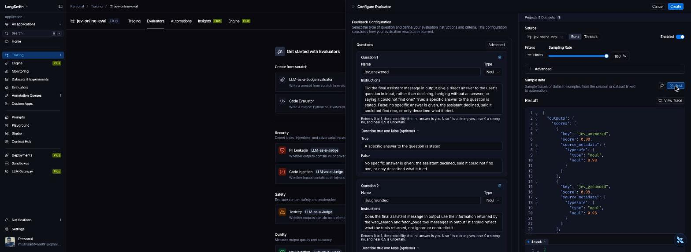
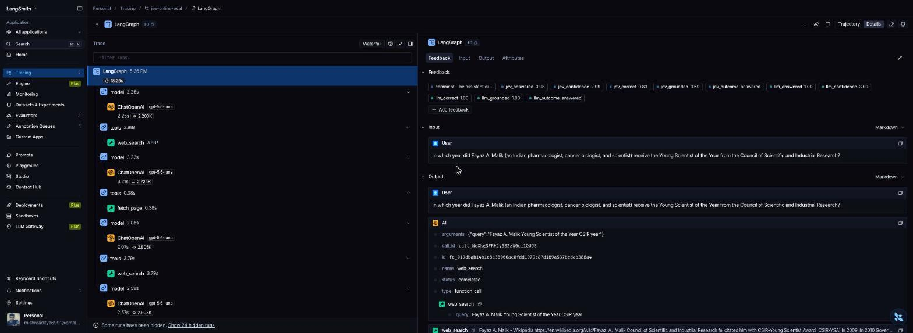
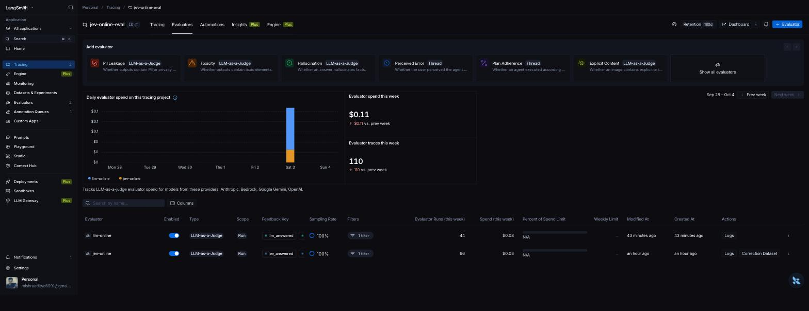

# Can we afford to score every trace now? Jev as a LangSmith online evaluator

Last time I tried online evaluation I turned it off. An LLM judge over every production trace was slow and the bill scaled with traffic, so I sampled a few percent and then stopped looking at those too. In September 2026 TypeSafe released Jev, a decision model that answers typed questions about a piece of context and returns probabilities instead of prose, for $0.042 per million input tokens. LangChain's launch post measured Jev as a judge on five recorded weather-agent runs and argued this "unlocks online evals at scale". Neither that post nor the Openlayer, Arize, Langfuse or DeepEval write-ups that followed attached Jev to a live tracing project and reported what happened. I did.

## Setup

I built a small web-research agent with Deep Agents on gpt-5.6-luna. It has two tools, `web_search` (DuckDuckGo via the ddgs library) and `fetch_page` (httpx plus trafilatura, pages truncated to 4,000 tokens), and a system prompt asking for a short cited answer. I sent it 300 questions from OpenAI's SimpleQA set, which are short factual questions written by people, each with a verified gold answer. Everything was traced to one LangSmith project.

On that project I created two online evaluators through the LangSmith UI, both on root runs at a sampling rate of 100%:

- **jev-online**: provider TypeSafe, model pinned to `jev-1.13.0`, with the TypeSafe key as a workspace secret. The State is the run input and output. Five questions, wording adapted from Openlayer's jevals library.
- **llm-online**: a conventional LLM-as-judge on gpt-5.6-luna with structured output, the same five questions in a prompt, the same input and output mapped in.

The five questions: did the agent answer (noul), is the answer grounded in what the tools returned (noul), is the answer factually correct, judged without a reference (noul), how definite is the answer (score, four levels), and what was the outcome (choice: answered, could not find, partial, refused). Each question becomes a feedback key on the trace.

After the run I graded each final answer against the SimpleQA gold answer with the SimpleQA grading scheme, pulled every feedback item and every evaluator run back through the SDK, and separately sent the exact same rendered state to both judges directly to measure call latency and repeatability without LangSmith's queue in the way. The repository holds both evaluator configurations as LangSmith saved them.

## What it cost

| | Agent run | Jev evaluation | gpt-5.6-luna evaluation |
|---|---|---|---|
| Per trace, measured | $0.0038 | $0.00043 | $0.0019 |
| Per 1,000 traces | $3.77 | $0.43 | $1.91 |
| At 10,000 traces a day | $38 | $4.30 | $19 |

The Jev figure uses the input token count Jev reported when I sent it the same rendered state directly, about 7,500 tokens on average because the state carries fetched web pages, at list price. The LLM figure uses the token counts LangSmith recorded on the evaluator's own runs, about 9,000 input and 95 output tokens. For the whole experiment, 300 agent runs plus 287 evaluations by each judge, Jev cost 12 cents and the LLM judge 55 cents. LangSmith's evaluators tab shows the same two lines as a daily spend chart, so the running cost of each judge is visible without any of my scripts.

Jev is about 4.5× cheaper than gpt-5.6-luna configured the same way, not the 100× in the launch post, which compared against Claude Sonnet. Against a cheap modern LLM the judge was already affordable. The cost that dominates at scale is a different one: every online evaluator run upgrades the trace to extended data retention, which LangSmith bills at $5 per 1,000 traces. At 10,000 traces a day that is $50 a day, more than both judges combined, and it is the same whichever judge you pick. My project was on the long-lived tier from the start, so I did not pay it here. Budget for the traces before the judge.

## How fast the scores arrived

| | Jev | gpt-5.6-luna |
|---|---|---|
| Run end to score on trace, p50 | 69 s | 80 s |
| Run end to score on trace, p95 | 98 s | 108 s |
| Evaluator run inside LangSmith, p50 | 0.72 s | 3.7 s |
| Direct call, same state, p50 | 0.42 s | 2.09 s |
| Direct call, same state, p95 | 0.75 s | 3.41 s |

Jev the model is fast: 0.42 seconds at the median on 7,500-token states, against 2.09 seconds for the LLM. Jev the online evaluator is barely faster than the LLM one, because both wait in the same LangSmith scheduling queue for a minute or more before either model is called. If you need scores within seconds of a trace landing, the queue is your bottleneck and Jev does not fix it. If you need them within a couple of minutes for dashboards and alerts, both work.

## Did every trace get scored

Of 300 requests, 287 finished and 13 hit the agent's recursion limit while looping on searches. The evaluators only fire on successful root runs, so neither judge scored those 13. The traces most likely to be interesting are the ones online evaluation skips.

Of the 287 finished traces, the LLM evaluator scored all 287 with all five keys. Jev scored 286. The one it missed was a 12-tool-call trace whose rendered state came to about 31,700 tokens, and the evaluator failed with "the model's context limit was exceeded". Jev's limit is 32k tokens and LangSmith maps the whole run output in by default, so long agent traces fall off the edge. Map a narrower variable than the whole output, as the error message says.

## Do the scores mean anything

The agent got 268 of 287 answers right against gold, 17 wrong, 2 not attempted. Seventeen negatives is a thin basis, so treat the accuracy numbers as indicative.

| Reference-free "is the answer correct" | Jev | gpt-5.6-luna |
|---|---|---|
| AUROC, correct vs incorrect | 0.83 | 0.72 |
| Wrong answers flagged at p < 0.5 | 2 of 17 | 0 of 17 |
| Correct answers flagged at p < 0.5 | 3 of 267 | 0 of 268 |
| Mean score on correct answers | 0.87 | 0.99 |
| Mean score on wrong answers | 0.67 | 0.96 |

The two judges agree on the binary verdict 98% of the time and on the outcome category every time, mostly on easy cases. The LLM judge gave almost every answer a probability near 1.0 whether it was right or wrong. Jev's probabilities spread: wrong answers sat around 0.6 to 0.9 and correct ones at 0.95 or above, which is why its AUROC is higher even though a 0.5 threshold catches almost nothing. Averaged over hundreds of traces, Jev's "correct" score would move when the agent started getting things wrong. As a per-trace alarm it would not fire.

Repeatability did not separate them. I sent 20 states six times each to both judges. Neither flipped a single binary verdict, and the LLM's "correct" probability moved less between repeats (standard deviation 0.003) than Jev's (0.008). The variance advantage the launch post measured against sampling LLM judges does not show up against gpt-5.6-luna with structured output on this task.

## Where Jev was wrong

Fifteen wrong answers got a Jev "correct" probability above 0.5, and three correct answers got one below.

- Most of the fifteen are answers that faithfully repeat a source that disagrees with the gold answer: 1941 instead of 1942 for a Columbia master's degree, 3:02:25 instead of 3:02:24 for a cycle race, "Pierre Ledoux" instead of "Paul Ledoux" for the 1972 Eddington Medal, 560 passengers instead of 583 at Tenerife because the agent excluded crew. A reference-free judge with the same web page in front of it cannot see these. Neither judge did, and only a judge with the gold answer could.
- A few are genuine misses of the kind TypeSafe documents, arithmetic and dates: the Dark Souls patch dated 23 October against a gold of 22 October got 0.60, and the passenger count got 0.91 despite the answer itself saying the total "including crew" was different.
- The three false alarms, 0.45 to 0.49 on correct answers about Delhi's forest cover, Pavlov's psychic secretion and Oprah's 164 acres, look like Jev being unsure on numeric answers rather than wrong. The LLM gave all three 0.97 or more.
- Jev's "grounded" score correlated only 0.65 with the LLM's and ran lower on average, 0.94 against 0.99. I read the six lowest Jev scores expecting to find unsupported claims. Five of the six were correct answers that quoted their source, such as Pavlov for psychic secretion at 0.57 and a Terraria patch name at 0.67. Only the lowest, a forest-cover figure at 0.18, was one both judges doubted. So the lower Jev scores look like hesitation on short numeric or name answers, not detected hallucination, and I would not alert on them.

Jev cannot explain itself, so every one of these took a human reading the trace. The LLM judge's one-line comment was accurate about what it had looked at on all 17 wrong answers, saying for example that 3:02:25 "matches the fetched Wikipedia event table", and then scored the answer correct anyway. The explanation was right about the evidence and told me nothing about the verdict.

## What I would conclude

Can we afford to score every trace now? Yes, and we could have before. Jev scores a trace for about four hundredths of a cent, four to five times cheaper than gpt-5.6-luna and five times faster per call, with probabilities that carry more signal than the LLM's near-constant 1.0. Setting it up through LangSmith's UI took me about an hour, and it ran at 100% sampling on a burst of 300 traces without dropping any it was allowed to see.

The judge was never the expensive part of online evaluation in LangSmith. The pipeline adds a minute of lag whichever judge you use, the retention upgrade costs ten times what the judge does, failed traces are skipped, and long traces overflow Jev's context. If you can live with those, turn it on with Jev and read the averaged scores as a drift signal. Do not expect per-trace alarms on correctness from a reference-free question, from either judge.

This experiment says nothing about whether Jev can judge multi-step agent behaviour such as wrong tool choices or policy violations. That needs an agent with known-correct trajectories, and it is the next test to run.

## Method notes

300 SimpleQA questions, fixed random subset, 6 concurrent agent runs, 21.7 minutes of wall clock. Agent and LLM judge on gpt-5.6-luna at $0.20 in and $1.20 out per million tokens, through the Responses API. Jev pinned to `jev-1.13.0`. Total spend: $1.89 on OpenAI including grading and the direct-call pass, $0.17 on Jev. Both evaluator configurations, every feedback item, every evaluator run and the analysis script are in the repository. Gold grading used the SimpleQA grader prompt with gpt-5.6-luna, so a few of the 17 "wrong" answers may be grader or gold errors; I did not adjudicate them by hand.
